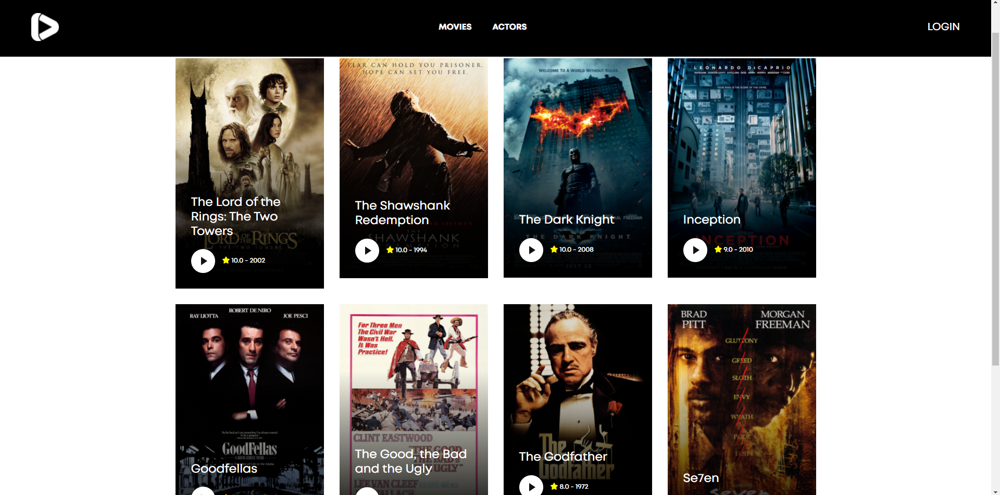
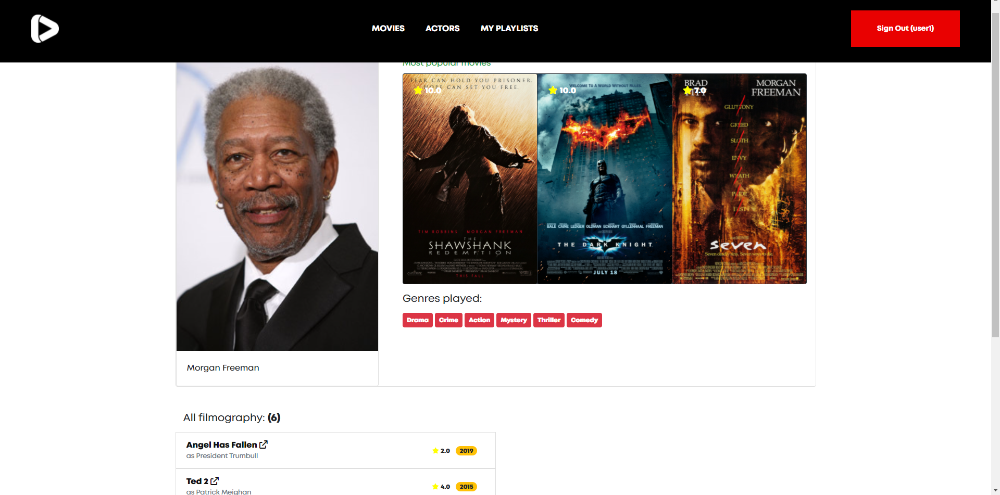
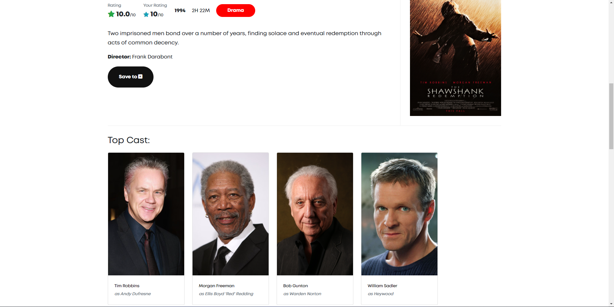
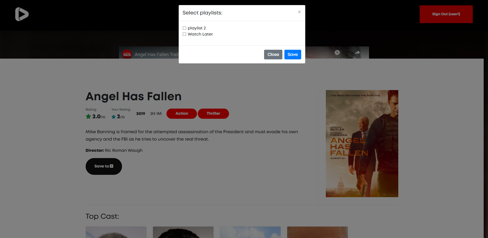
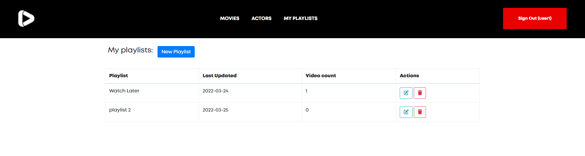
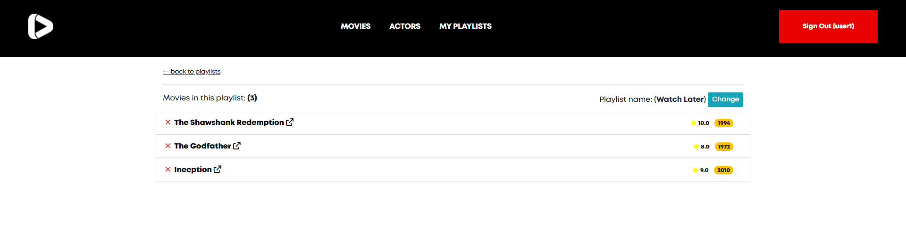

# moviesdb
An application similar to IMDB where you can browse movies, actors...

## Screenshots

Browse Movies             |  Browse Actors
:-------------------------:|:-------------------------:
  |  
Movie Details             |  Actor Details
  |  
Movie Details             |  Movie Details - save to playlists
  |  
Playlists             |  Playlist Details
  |  

## How to run the application
I've used Postgres as database. In project root path you can find two files `schema.sql` and `data.sql`. Execute statements inside `schema.sql` to create necessary tables. Than execute statements in `data.sql` to insert some data (with some real data that belongs to IMDB).

As for the application, the application is built with SpringBoot (using maven). To start the application, just run the main class as any other SpringBoot app. Than visit `localhost:8080` in browser. You can then browse movies and actors. If you want to create your own playlists with movies saved or if you want to rate movies, you need to be logged in. You can login with a already inserted user in database, or you can register at `localhost:8080/users/register`.

```
Default created user:
username: user1
password: 123
```
